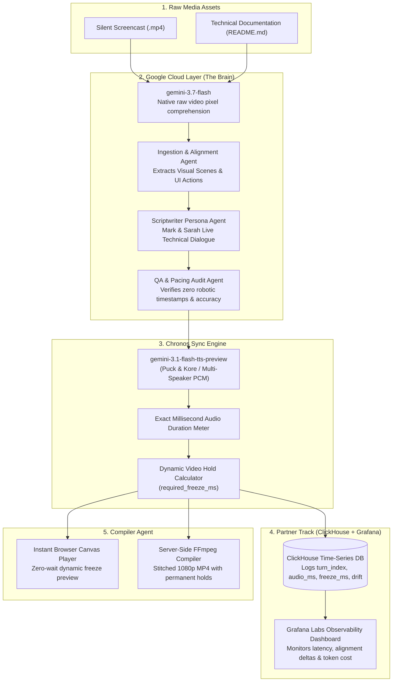

# 🎙️ Frame Talk: The Multimodal Screen-to-Podcast Studio Engine

> **Built for the Agentic Cinema Hackathon**  
> *Transforming silent developer screencasts and documentation into synchronized, two-host technical podcast walkthroughs using Google Gemini 3.7 Flash, ClickHouse, and Grafana.*  
> **Domain:** `frame-talk.com`

---

## 🌟 The Core Problem & The Frame Talk Solution

### The Gap in Current Tools (NotebookLM & Video Documentation)
1. **NotebookLM is Blind to Video Screencasts:** While NotebookLM can generate audio summaries from text documents or transcripts, it **cannot** visually inspect an unedited silent application screencast (`.mp4`) or synchronize audio commentary with live UI transitions.
2. **Screen-Audio Timing Desynchronization:** In traditional screencast tools, the video runs at fixed 1.0x speed. Whenever AI narrators spend extra time explaining a complex architecture or terminal output, the audio falls seconds behind the screen—leading to hosts talking about past screens or previewing future screens before they appear.
3. **Robotic Gaps vs. Continuous Dialogue:** Old tools insert 5–10s of dead silence buffers between turns to force speech into guessed timestamps, resulting in awkward, robotic ping-pong monologues.

### 💡 The Frame Talk Innovation
* **Gemini 3.7 Flash Multimodal Comprehension:** Ingests raw `.mp4` video pixels directly, cross-referencing visual clicks, inputs, and state changes with `README.md` documentation.
* **The Chronos Sync Engine:** Dialogue lines are synthesized into uncompressed 24 kHz PCM via **`gemini-3.1-flash-tts-preview`**, measuring runtime duration down to the millisecond (`duration_ms = pcm_bytes / 48`).
* **Dynamic Visual Hold (Timeline Stretching):** When discussion in a visual scene requires more time than the screen naturally stayed on that state, Chronos calculates `required_freeze_ms`. The **Compiler Agent** dynamically expands the video timeline at the focal action point, holding the relevant UI state while the hosts conclude their explanation, then resuming in exact lockstep!
* **Organic Live Conversation:** Hosts **Mark** (Lead Systems Architect) and **Sarah** (Dev Advocate & UX Specialist) engage in rapid, collaborative dialogue with natural human turn-taking pauses (180ms – 240ms), realistic interjections, and zero synthetic timestamps.

---

## 🏛️ System Architecture



---

## 🛠️ Mandatory Technical Stack Integration

### 1. Google Cloud Layer (The Core Brain)
- **`gemini-3.7-flash` (Vision & Brain Workhorse):** Native video token execution analyzing temporal UI actions, clicks, and terminal logs directly from video pixels without external transcripts.
- **`gemini-3.1-flash-tts-preview` (Audio & Speech):** Multi-speaker raw PCM synthesis (`Puck` for Mark, `Kore` for Sarah) enabling millisecond-precision duration metering.

### 2. Partner Track Layer: ClickHouse + Grafana Labs
- **ClickHouse (Data Logging Layer):** Micro-dialogue generation events are written in real-time to the `castops.sync_events` table via `clickhouse-connect`, tracking exact audio lengths, target video scene timestamps, and `required_freeze_ms`.
- **Grafana Labs (Observability Layer):** Pre-provisioned dashboards track pipeline processing latency, audio-to-video alignment deltas, and token expenditure.

---

## 🚀 Quickstart & Local Setup

### Prerequisites
- Python 3.12 (`.pythonversion`)
- Node.js 18+
- FFmpeg (in system PATH)
- Docker & Docker Compose (optional, for local ClickHouse + Grafana)

### 1. Setup Python 3.12 Virtual Environment & Install Dependencies
```bash
git clone https://github.com/tdk67/BlockbusterHackaton.git
cd BlockbusterHackaton
py -3.12 -m venv .venv
.\.venv\Scripts\activate  # On Linux/macOS: source .venv/bin/activate
pip install -r requirements.txt
```

### 2. (Optional) Launch ClickHouse & Grafana
```bash
docker-compose -f observability/docker-compose.yml up -d
```

### 3. Start Frame Talk Studio Engine
```bash
python -m server.app
```
Open **`http://localhost:8000`** in your browser.

### 4. Run the Evaluation Suite (Evals)

Frame Talk features a **3-stage decoupled evaluation architecture** with an independent dataset located in [`server/evals/dataset/`](server/evals/dataset/):
* `dataset_config.json`: Configures the video, duration, and expected ground truth files.
* `Aufzeichnung 2026-08-30 094915.mp4`: Reference 228MB screencast (4m22s).
* `expected_scenes.json`: 9-scene ground truth breakdown transcribed from reference Gemini analysis.
* `expected_dialogue.json`: 19-turn gold-standard banter between Mark and Sarah.
* `sample_readme.md`: Reference project documentation.

You can run evaluations from the project root or directly from `server/evals`:

#### 🚀 Option A: Run from `server/evals` (Quickest)
```powershell
cd server/evals

# 1. Run all 3 evaluation stages consecutively (Instant Benchmark):
python run_all_evals.py --all

# 2. Stage 1 — Fast Format Limits & Expected Scenes Benchmark:
python eval_1_video_analyzer.py

# 3. Stage 1 — LIVE Multimodal Test against real Gemini 3.7 Flash API (~2 mins):
# Uploads the 228MB video to Gemini File API, extracts live scenes, and saves to live_extracted_scenes.json:
python eval_1_video_analyzer.py --live

# 4. Stage 1 — Edge Cases Battery (< 30s rejection, > 300s rejection, .webm acceptance, .avi rejection):
python eval_1_video_analyzer.py --edge-cases

# 5. Stage 2 — Dialogue Generation (Fast Benchmark):
python eval_2_dialogue_script.py --benchmark

# 6. Stage 2 — LIVE Script Generation with Gemini 3.7 Flash:
python eval_2_dialogue_script.py --live

# 7. Stage 3 — QA Auditor Discrimination & Defect Injection (Heuristic Mode):
python eval_3_qa_auditor.py

# 8. Stage 3 — LIVE Gemini 3.7 Flash LLM-as-a-Judge Audit:
python eval_3_qa_auditor.py --live
```

#### 🌐 Option B: Run from Project Root
```bash
# Run all 3 stages:
python -m server.evals.run_all_evals --all

# Run Live Gemini 3.7 Flash Video Analysis:
python -m server.evals.eval_1_video_analyzer --live

# Run Live Gemini 3.7 Flash Script Generation:
python -m server.evals.eval_2_dialogue_script --live

# Run Live Gemini 3.7 Flash LLM-as-a-Judge:
python -m server.evals.eval_3_qa_auditor --live
```

| Evaluation Command | Runtime | What It Tests |
| :--- | :--- | :--- |
| `python run_all_evals.py --all` | $< 2$ sec | Runs all 3 stages against the ground-truth benchmark and prints an aggregated scorecard. |
| `python eval_1_video_analyzer.py --live` | $\approx 2$ min | **Live Video AI Test:** Uploads 228MB video to Gemini File API, analyzes video tokens with `gemini-3.7-flash`, saves `live_extracted_scenes.json`, and scores against ground truth. |
| `python eval_1_video_analyzer.py --edge-cases` | $< 1$ sec | Tests validation limits: $<30$s rejection, $>300$s (5 min) rejection, `.avi` rejection, `.webm` acceptance. |
| `python eval_2_dialogue_script.py --live` | $\approx 5$ sec | **Live Script AI Test:** Sends 9 scenes + README to `gemini-3.7-flash`, generates conversational dialogue, saves `live_generated_dialogue.json`, and evaluates anchoring, cadence, and anti-timestamp constraints. |
| `python eval_3_qa_auditor.py --live` | $\approx 4$ sec | **Live LLM-as-a-Judge:** Calls `gemini-3.7-flash` as a forensic judge on both gold-standard dialogue and injected defect dialogue (timestamps, hallucinations) to verify discrimination accuracy. |

Full methodology, metrics, and ground-truth schemas are documented in [**`TEST_PLAN.md`**](TEST_PLAN.md).

---

## 📄 License
This project is licensed under the **MIT License** - see the [LICENSE](LICENSE) file for details.
