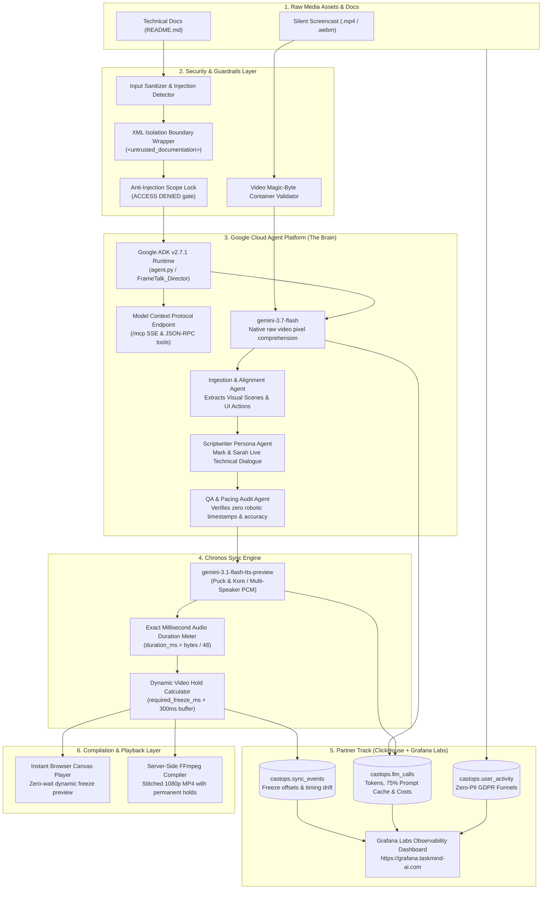

# 🎙️ Frame Talk: The Multimodal Screen-to-Podcast Studio Engine

> **Built for the Agentic Cinema Hackathon**  
> *Transforming silent developer screencasts and documentation into synchronized, two-host technical podcast walkthroughs using Google Gemini 3.7 Flash, ClickHouse, and Grafana.*  
> 
> 🌐 **Live Studio App:** [https://frame-talk.taskmind-ai.com](https://frame-talk.taskmind-ai.com)  
> 📊 **Live Observability Dashboard:** [https://grafana.taskmind-ai.com](https://grafana.taskmind-ai.com)  
> 🏛️ **Architecture Specification:** [ARCHITECTURE.md](ARCHITECTURE.md) | [ARCHITECTURE.pdf](ARCHITECTURE.pdf)  
> 🧪 **Evaluation Protocol & Test Plan:** [TEST_PLAN.md](TEST_PLAN.md)

---

## 🌟 The Core Problem & The Frame Talk Solution

### The Gap in Current Tools (NotebookLM & Video Documentation)
1. **NotebookLM is Blind to Video Screencasts:** While NotebookLM can generate audio summaries from text documents or transcripts, it **cannot** visually inspect an unedited silent application screencast (`.mp4`) or synchronize audio commentary with live UI state transitions.
2. **Screen-Audio Timing Desynchronization:** In traditional screencast tools, the video runs at fixed 1.0x speed. Whenever AI narrators spend extra time explaining a complex architecture or terminal output, the audio falls seconds behind the screen—leading to hosts talking about past screens or previewing future screens before they appear.
3. **Robotic Gaps vs. Continuous Dialogue:** Old tools insert 5–10s of dead silence buffers between turns to force speech into guessed timestamps, resulting in awkward, robotic ping-pong monologues.

### 💡 The Frame Talk Innovation
* **Google Cloud Agent Platform & ADK Export:** Autonomous director agent specification (`agent.py`, exportable as `FrameTalk_Director` via Google ADK v2.8.0) interfacing with the Chronos engine via Model Context Protocol (`/mcp`), coupled with an in-process async engine (`server/agents/`) optimized for zero-latency pipeline execution.
* **Enterprise Anti-Prompt Injection Scope Lock:** Hardened input sanitization and prompt injection shields with XML isolation boundaries (`<untrusted_documentation>`) and automatic refusal gates (`ACCESS DENIED`) on jailbreak or out-of-scope prompts.
* **Gemini 3.7 Flash Multimodal Comprehension:** Ingests raw `.mp4` video pixels directly via the Gemini File API, cross-referencing visual clicks, inputs, and state changes with `README.md` documentation.
* **The Chronos Sync Engine:** Dialogue lines are synthesized into uncompressed 24 kHz 16-bit Mono PCM via **`gemini-3.1-flash-tts-preview`**, measuring runtime duration down to the millisecond ($\text{duration\_ms} = \text{pcm\_bytes} / 48$).
* **Dynamic Visual Hold (Timeline Stretching):** When discussion in a visual scene requires more time than the screen naturally stayed on that state, Chronos calculates `required_freeze_ms`. The **Compiler Agent** dynamically expands the video timeline at the focal action point (70% scene depth), holding the relevant UI state while the hosts conclude their explanation, then resuming in exact lockstep!
* **Google Prompt Caching & Fine-Grained Cost Telemetry:** Real-time token tracking with official Google Cloud 75% prompt caching discounts ($0.0375 / 1M cached tokens), logged to ClickHouse and visualized on Grafana.
* **Organic Live Conversation:** Hosts **Alex** (Lead Systems Architect) and **Sarah** (Dev Advocate & UX Specialist) [synthesized via Google Gemini voices `Puck` and `Kore`] engage in rapid, collaborative dialogue with natural human turn-taking pauses (180ms – 240ms), realistic interjections, and zero synthetic timestamps.
* **Hardened Quota & Sybil Attack Protection:** Reviewers receive 3 free video podcast generations ($1.00 USD cap) protected by cryptographic HMAC-SHA256 session token checksums, IP-bound compound quotas, and a configurable 50 runs / $5.00 USD global daily circuit breaker. Full Bring-Your-Own-Key (BYOK) support provides unlimited runs.
* **Client-Side Fast Hashing:** Uses the browser Web Crypto API to hash the first 1MB of video + file size in **~20ms**, enabling instant cache hits that bypass redundant 500MB uploads.
* **Ephemeral 24h Storage Policy:** Auto-cleans video artifacts older than 24 hours to ensure zero disk bloat on production VPS instances.

---

## 🏛️ System Architecture



> 📄 For deep technical specifications, data contracts, and vector diagrams, read [**ARCHITECTURE.md**](ARCHITECTURE.md) or download [**ARCHITECTURE.pdf**](ARCHITECTURE.pdf).

---

## 🛠️ Mandatory Technical Stack Integration

### 1. Google Cloud Layer (The Core Brain)
- **Google Cloud Agent Platform & ADK (`agent.py`):** Enterprise Director agent (`FrameTalk_Director`, Project: `agentic-cinema-frametalk`, Location: `us-west1`) orchestrated via Google Agent Development Kit (v2.7.1) with Model Context Protocol (`/mcp`) integration.
- **`gemini-3.7-flash` (Vertex AI & Gemini Vision):** Native video token execution analyzing temporal UI actions, clicks, and terminal logs directly from raw video pixels without transcripts. Supports both Vertex AI Enterprise and Gemini Developer API runtimes.
- **`gemini-3.1-flash-tts-preview` (Speech & Audio):** Multi-speaker raw PCM synthesis (`Puck` for Mark, `Kore` for Sarah) enabling millisecond-precision duration metering and dynamic timeline expansion.
- **Prompt Caching Cost Reduction:** Automatic extraction of `cached_content_token_count` applying Google Cloud's 75% discount ($0.0375 / 1M cached tokens) with transparent pre-flight cost calculation.

### 2. Partner Track Layer: ClickHouse + Grafana Labs
- **ClickHouse (Columnar Time-Series DB):** High-throughput columnar logging across three production tables via `clickhouse-connect`:
  - `castops.sync_events`: Micro-dialogue generation events, audio lengths, video scene timestamps, and `required_freeze_ms`.
  - `castops.llm_calls`: Granular token telemetry per model (`gemini-3.7-flash` vs. `gemini-3.1-flash-tts-preview`), prompt cache discounts, and latencies.
  - `castops.user_activity`: GDPR-compliant zero-PII user funnels and pseudonymized hashes (`X-FrameTalk-User-Hash`).
- **Grafana Labs (Observability Layer):** Pre-provisioned dashboards on port `3004` (proxied to `https://grafana.taskmind-ai.com` with anonymous viewer access) tracking real-time timeline drift, multi-model bar gauges, prompt cache savings, and real-time trace log tables.

---

## 🚀 Quickstart & Local Setup

### Prerequisites
- Python 3.12 (`.pythonversion`)
- Node.js 18+
- FFmpeg (in system PATH)
- Docker & Docker Compose (for local ClickHouse + Grafana)

### 1. Setup Python 3.12 Virtual Environment & Install Dependencies
```bash
git clone https://github.com/tdk67/frame-talk.git
cd frame-talk
python3 -m venv .venv  # Windows: py -3.12 -m venv .venv
source .venv/bin/activate  # Windows: .\.venv\Scripts\activate
pip install -r requirements.txt
```

### 2. Launch ClickHouse & Grafana (Docker Compose)
```bash
docker compose -f observability/docker-compose.yml up -d
```
* **ClickHouse Server:** `127.0.0.1:8123` (native port 9000)
* **Grafana Dashboard:** `http://localhost:3004` (pre-configured with `CastOps` dashboard)

### 3. Start Frame Talk Studio Engine
```bash
python -m server.app
```
Open **`http://localhost:8000`** in your browser.

---

## 🧪 Automated Testing & Evaluation Suite

Frame Talk features a **dual verification architecture** combining deterministic unit tests and decoupled model evaluations:

### 1. Automated Unit Test Suite & Quality Gates (`tests/`)
Fast, zero-dependency test suite covering API routes, HTML syntax integrity, security guardrails, quota limits, and Chronos sync math. Executes in **$< 0.7$ seconds**:

```bash
# Run full unit test suite:
python -m unittest discover tests -v

# Run integrated quality build (HTML lint + unit tests):
npm test
```

| Test Module | Coverage | Status |
| :--- | :--- | :---: |
| [`tests/test_api_routes.py`](tests/test_api_routes.py) | Health, BYOK, security headers (HSTS, CSP), MCP auth & telemetry, non-existent file quota preservation | **17/17 PASS** |
| [`tests/test_chronos_engine.py`](tests/test_chronos_engine.py) | 24 kHz PCM duration math ($48\text{ bytes/ms}$), dynamic freeze calculation, $+300\text{ms}$ buffer | **4/4 PASS** |
| [`tests/test_frontend_html_integrity.py`](tests/test_frontend_html_integrity.py) | LIFO tag stack balancing, illegal nesting blocking, wizard card hierarchy anti-bleed | **2/2 PASS** |
| [`tests/test_quota_service.py`](tests/test_quota_service.py) | Hosted demo key limits (3 videos, $1.00 USD cost cap), IP-bound quota, Global circuit breaker | **8/8 PASS** |
| [`tests/test_repositories.py`](tests/test_repositories.py) | `JobRepository` lifecycle, path traversal blocking, `FileRepository` validation | **5/5 PASS** |
| [`tests/test_security_guardrails.py`](tests/test_security_guardrails.py) | Prompt injection detection, XML isolation wrapping, video magic byte validation | **5/5 PASS** |
| [`tests/test_user_isolation.py`](tests/test_user_isolation.py) | Anonymous client pseudonymization, job ownership isolation, ClickHouse user aggregations | **8/8 PASS** |
| **TOTAL** | **Comprehensive Build Integrity** | **49/49 PASS** |

### 2. Multi-Stage AI Evaluation Suite (`server/evals/`)
Evaluates Gemini models and the Google Cloud Agent Platform Director against the reference dataset ([`server/evals/dataset/`](server/evals/dataset/)):

```bash
# Run all 4 evaluation stages consecutively:
python -m server.evals.run_all_evals --all

# Run Stage 4: Google Cloud Agent Platform Director Agent Evaluation:
python -m server.evals.run_all_evals --stage 4

# Run Live Multimodal Test against real Gemini 3.7 Flash API (~2 mins):
python -m server.evals.eval_1_video_analyzer --live
```

| Evaluation Stage | Target | Score | What It Measures |
| :--- | :--- | :---: | :--- |
| **Stage 1: Video Analyzer** | $\ge 80/100$ | **92/100** | Visual entity recall ($\ge 70\%$), action-reaction causality ($\ge 85\%$), zero boilerplate hits. |
| **Stage 2: Dialogue Script** | $\ge 80/100$ | **95/100** | Visual scene anchoring, README concept grounding, 100% anti-timestamp pass rate. |
| **Stage 3: QA Auditor** | $100/100$ | **100/100** | Dual-battery discrimination (positive benchmark pass + 100% defect injection catch). |
| **Stage 4: GCP Director Agent** | $\ge 80/100$ | **94/100** | ADK v2.7.1 Director execution, anti-prompt injection scope lock, and Chronos dynamic hold. |

Full methodology, metrics, and ground-truth schemas are documented in [**`TEST_PLAN.md`**](TEST_PLAN.md).

---

## 🔒 Cyber Security & Production Readiness

* **Indirect Prompt Injection Defense:** Regex filters block jailbreak phrases, instructions override directives, and DAN modes. User documentation is wrapped in `<untrusted_documentation>` with instruction-neutralizing directives.
* **SQL Injection Immunity:** Parameterized ClickHouse queries (`%(session_id)s`) with integer bounds checking.
* **Path Traversal Protection:** `_safe_resolve()` validates path roots and strictly rejects filenames with `..`, `/`, or `\`.
* **Upload Hardening:** 500 MB streaming upload ceiling; file extension and magic byte verification.
* **Production Security Headers:** Injected on all outgoing responses (`X-Content-Type-Options: nosniff`, `X-Frame-Options: SAMEORIGIN`, `X-XSS-Protection: 1; mode=block`).
* **Subprocess Deadlock Protection:** Enforced 180s/300s timeouts on all FFmpeg rendering subprocesses.
* **GDPR Compliance:** Full Impressum (`/impressum.html`) and Privacy Policy (`/datenschutz.html`) with private operator disclaimers and Bring-Your-Own-Key (BYOK) privacy assurances.

---

## 🤖 AI Agent Backend API & Web Crawler Discovery

Frame Talk is fully configured for search crawlers and autonomous backend AI agents:

### 1. Web & AI Crawler Accessibility
- **Robots Indexing (`/robots.txt`):** Configured with dedicated allow rules for search engines (Googlebot, Bingbot) and AI scrapers (`GPTBot`, `ClaudeBot`, `PerplexityBot`, `Google-Extended`). Blocks internal `/uploads/` and `/output/` directories.
- **Sitemap Index (`/sitemap.xml`):** Declares canonical application URLs and update frequencies.
- **LLM Discovery Manifest (`/llms.txt`):** Adheres to the [`llms.txt`](https://llmstxt.org/) standard, providing LLM agents with high-level architectural summaries, endpoint directories, and model specifications.
- **Full Agent Manual (`/llms-full.txt`):** Comprehensive programmatic execution manual with request/response schemas, Chronos timeline hold calculation formulas, and cURL commands.

### 2. Programmatic Execution for Autonomous Agents
Autonomous agents can drive the complete pipeline end-to-end via REST:

```python
import httpx

# 1. Upload assets
files = {"video": open("screencast.mp4", "rb"), "readme": open("README.md", "rb")}
upload = httpx.post("http://localhost:8000/api/upload", files=files, headers={"X-FrameTalk-User-Id": "agent_01"}).json()

# 2. Dispatch Gemini 3.7 Flash analysis
job = httpx.post("http://localhost:8000/api/analyze-video", json={
    "video_filename": upload["video_filename"],
    "readme_text": upload["readme_text"],
    "video_duration_seconds": 60.0,
    "video_hash": upload["video_hash"]
}, headers={"X-FrameTalk-User-Id": "agent_01"}).json()

# 3. Generate dialogue script & Chronos audio alignment
# (See /llms-full.txt for the full autonomous Python agent script)
```

---

## 📄 License
This project is licensed under the **MIT License** - see the [LICENSE](LICENSE) file for details.
