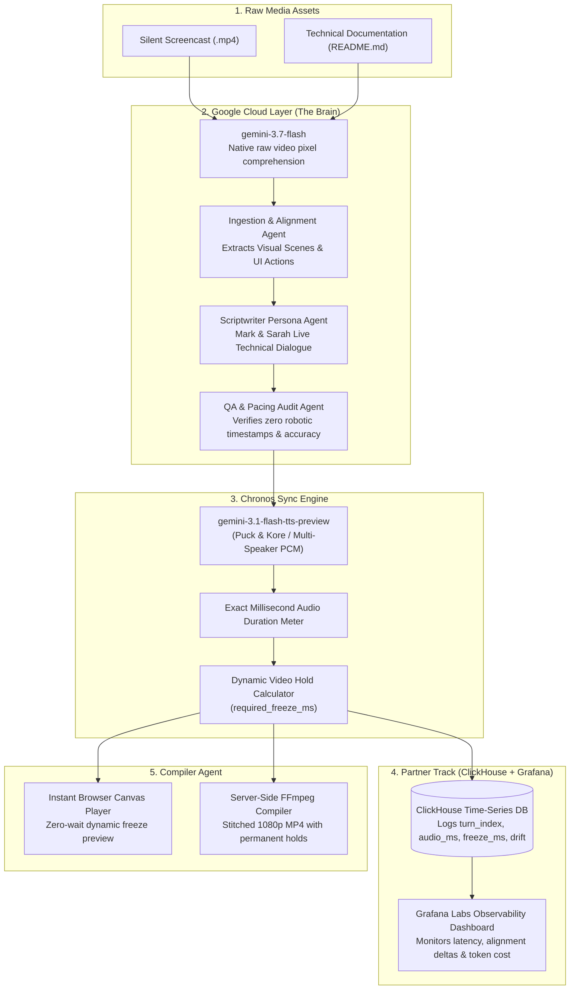

# 🎙️ Frame Talk: The Multimodal Screen-to-Podcast Studio Engine

> **Built for the Agentic Cinema Hackathon**  
> *Transforming silent developer screencasts and documentation into synchronized, two-host technical podcast walkthroughs using Google Gemini 3.7 Flash, ClickHouse, and Grafana.*  
> **Domain:** `frame-talk.com`

---

## 🌟 The Core Problem & The Frame Talk Solution

### The Gap in Current Tools (NotebookLM & Video Documentation)
1. **NotebookLM is Blind to Video Screencasts:** While NotebookLM can generate audio summaries from text documents or transcripts, it **cannot** visually inspect an unedited silent application screencast (`.mp4`) or synchronize audio commentary with live UI transitions.
2. **Screen-Audio Timing Desynchronization:** In traditional screencast tools, the video runs at fixed 1.0x speed. Whenever AI narrators spend extra time explaining a complex architecture or terminal output, the audio falls seconds behind the screen—leading to hosts talking about past screens or previewing future screens before they appear.
3. **Robotic Gaps vs. Continuous Dialogue:** Old tools insert 5–10s of dead silence buffers between turns to force speech into guessed timestamps, resulting in awkward, robotic ping-pong monologues.

### 💡 The Frame Talk Innovation
* **Gemini 3.7 Flash Multimodal Comprehension:** Ingests raw `.mp4` video pixels directly, cross-referencing visual clicks, inputs, and state changes with `README.md` documentation.
* **The Chronos Sync Engine:** Dialogue lines are synthesized into uncompressed 24 kHz PCM via **`gemini-3.1-flash-tts-preview`**, measuring runtime duration down to the millisecond (`duration_ms = pcm_bytes / 48`).
* **Dynamic Visual Hold (Timeline Stretching):** When discussion in a visual scene requires more time than the screen naturally stayed on that state, Chronos calculates `required_freeze_ms`. The **Compiler Agent** dynamically expands the video timeline at the focal action point, holding the relevant UI state while the hosts conclude their explanation, then resuming in exact lockstep!
* **Organic Live Conversation:** Hosts **Mark** (Lead Systems Architect) and **Sarah** (Dev Advocate & UX Specialist) engage in rapid, collaborative dialogue with natural human turn-taking pauses (180ms – 240ms), realistic interjections, and zero synthetic timestamps.

---

## 🏛️ System Architecture



---

## 🛠️ Mandatory Technical Stack Integration

### 1. Google Cloud Layer (The Core Brain)
- **`gemini-3.7-flash` (Vision & Brain Workhorse):** Native video token execution analyzing temporal UI actions, clicks, and terminal logs directly from video pixels without external transcripts.
- **`gemini-3.1-flash-tts-preview` (Audio & Speech):** Multi-speaker raw PCM synthesis (`Puck` for Mark, `Kore` for Sarah) enabling millisecond-precision duration metering.

### 2. Partner Track Layer: ClickHouse + Grafana Labs
- **ClickHouse (Data Logging Layer):** Micro-dialogue generation events are written in real-time to the `castops.sync_events` table via `clickhouse-connect`, tracking exact audio lengths, target video scene timestamps, and `required_freeze_ms`.
- **Grafana Labs (Observability Layer):** Pre-provisioned dashboards track pipeline processing latency, audio-to-video alignment deltas, and token expenditure.

---

## 🚀 Quickstart & Local Setup

### Prerequisites
- Python 3.10+
- Node.js 18+
- FFmpeg (in system PATH)
- Docker & Docker Compose (optional, for local ClickHouse + Grafana)

### 1. Install Dependencies
```bash
git clone https://github.com/tdk67/BlockbusterHackaton.git
cd BlockbusterHackaton
pip install -r requirements.txt
```

### 2. (Optional) Launch ClickHouse & Grafana
```bash
docker-compose -f observability/docker-compose.yml up -d
```

### 3. Start Frame Talk Studio Engine
```bash
python -m server.app
```
Open **`http://localhost:8000`** in your browser.

---

## 📄 License
This project is licensed under the **MIT License** - see the [LICENSE](LICENSE) file for details.
