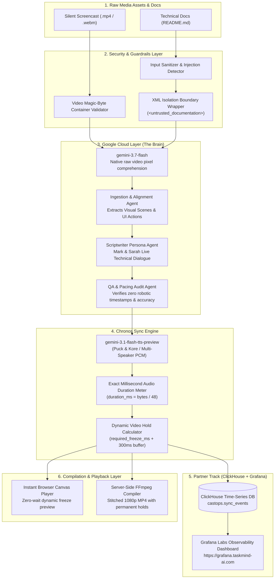

# 🎙️ Frame Talk: The Multimodal Screen-to-Podcast Studio Engine

> **Built for the Agentic Cinema Hackathon**  
> *Transforming silent developer screencasts and documentation into synchronized, two-host technical podcast walkthroughs using Google Gemini 3.7 Flash, ClickHouse, and Grafana.*  
> 
> 🌐 **Live Studio App:** [https://frame-talk.taskmind-ai.com](https://frame-talk.taskmind-ai.com)  
> 📊 **Live Observability Dashboard:** [https://grafana.taskmind-ai.com](https://grafana.taskmind-ai.com)  
> 🏛️ **Architecture Specification:** [ARCHITECTURE.md](ARCHITECTURE.md) | [ARCHITECTURE.pdf](ARCHITECTURE.pdf)  
> 🧪 **Evaluation Protocol & Test Plan:** [TEST_PLAN.md](TEST_PLAN.md)

---

## 🌟 The Core Problem & The Frame Talk Solution

### The Gap in Current Tools (NotebookLM & Video Documentation)
1. **NotebookLM is Blind to Video Screencasts:** While NotebookLM can generate audio summaries from text documents or transcripts, it **cannot** visually inspect an unedited silent application screencast (`.mp4`) or synchronize audio commentary with live UI state transitions.
2. **Screen-Audio Timing Desynchronization:** In traditional screencast tools, the video runs at fixed 1.0x speed. Whenever AI narrators spend extra time explaining a complex architecture or terminal output, the audio falls seconds behind the screen—leading to hosts talking about past screens or previewing future screens before they appear.
3. **Robotic Gaps vs. Continuous Dialogue:** Old tools insert 5–10s of dead silence buffers between turns to force speech into guessed timestamps, resulting in awkward, robotic ping-pong monologues.

### 💡 The Frame Talk Innovation
* **Gemini 3.7 Flash Multimodal Comprehension:** Ingests raw `.mp4` video pixels directly via the Gemini File API, cross-referencing visual clicks, inputs, and state changes with `README.md` documentation.
* **The Chronos Sync Engine:** Dialogue lines are synthesized into uncompressed 24 kHz 16-bit Mono PCM via **`gemini-3.1-flash-tts-preview`**, measuring runtime duration down to the millisecond ($\text{duration\_ms} = \text{pcm\_bytes} / 48$).
* **Dynamic Visual Hold (Timeline Stretching):** When discussion in a visual scene requires more time than the screen naturally stayed on that state, Chronos calculates `required_freeze_ms`. The **Compiler Agent** dynamically expands the video timeline at the focal action point (70% scene depth), holding the relevant UI state while the hosts conclude their explanation, then resuming in exact lockstep!
* **Organic Live Conversation:** Hosts **Mark / Alex** (Lead Systems Architect) and **Sarah / Sam** (Dev Advocate & UX Specialist) engage in rapid, collaborative dialogue with natural human turn-taking pauses (180ms – 240ms), realistic interjections, and zero synthetic timestamps.
* **Client-Side Fast Hashing:** Uses the browser Web Crypto API to hash the first 1MB of video + file size in **~20ms**, enabling instant cache hits that bypass redundant 500MB uploads.
* **Ephemeral 24h Storage Policy:** Auto-cleans video artifacts older than 24 hours to ensure zero disk bloat on production VPS instances.
* **Enterprise Security Guardrails:** Comprehensive regex protection against indirect prompt injections, XML isolation boundary wrapping (`<untrusted_documentation>`), and path traversal defenses.

---

## 🏛️ System Architecture



> 📄 For deep technical specifications, data contracts, and vector diagrams, read [**ARCHITECTURE.md**](ARCHITECTURE.md) or download [**ARCHITECTURE.pdf**](ARCHITECTURE.pdf).

---

## 🛠️ Mandatory Technical Stack Integration

### 1. Google Cloud Layer (The Core Brain)
- **`gemini-3.7-flash` (Vision & Brain Workhorse):** Native video token execution analyzing temporal UI actions, clicks, and terminal logs directly from video pixels without external transcripts.
- **`gemini-3.1-flash-tts-preview` (Audio & Speech):** Multi-speaker raw PCM synthesis (`Puck` for Mark, `Kore` for Sarah) enabling millisecond-precision duration metering.

### 2. Partner Track Layer: ClickHouse + Grafana Labs
- **ClickHouse (Data Logging Layer):** Micro-dialogue generation events are written in real-time to the `castops.sync_events` table via `clickhouse-connect`, tracking exact audio lengths, target video scene timestamps, and `required_freeze_ms`. Parameterized queries eliminate SQL injection vulnerabilities.
- **Grafana Labs (Observability Layer):** Pre-provisioned dashboards on port `3004` (proxied to `https://grafana.taskmind-ai.com` with anonymous viewer access) track pipeline processing latency, audio-to-video alignment deltas, and token expenditure.

---

## 🚀 Quickstart & Local Setup

### Prerequisites
- Python 3.12 (`.pythonversion`)
- Node.js 18+
- FFmpeg (in system PATH)
- Docker & Docker Compose (for local ClickHouse + Grafana)

### 1. Setup Python 3.12 Virtual Environment & Install Dependencies
```bash
git clone https://github.com/tdk67/BlockbusterHackaton.git
cd BlockbusterHackaton
py -3.12 -m venv .venv
.\.venv\Scripts\activate  # On Linux/macOS: source .venv/bin/activate
pip install -r requirements.txt
```

### 2. Launch ClickHouse & Grafana (Docker Compose)
```bash
docker compose -f observability/docker-compose.yml up -d
```
* **ClickHouse Server:** `127.0.0.1:8123` (native port 9000)
* **Grafana Dashboard:** `http://localhost:3004` (pre-configured with `CastOps` dashboard)

### 3. Start Frame Talk Studio Engine
```bash
python -m server.app
```
Open **`http://localhost:8000`** in your browser.

---

## 🧪 Automated Testing & Evaluation Suite

Frame Talk features a **dual verification architecture** combining deterministic unit tests and decoupled model evaluations:

### 1. Automated Unit Test Suite (`tests/`)
Fast, zero-dependency unit tests covering API routes, security guardrails, repository caching, and Chronos sync math. Executes in **$< 0.6$ seconds**:

```bash
python -m unittest discover tests -v
```

| Test Module | Coverage | Status |
| :--- | :--- | :---: |
| [`tests/test_api_routes.py`](tests/test_api_routes.py) | Health endpoint, BYOK validation, 404 handlers, security headers, ClickHouse & Pricing endpoints | **10/10 PASS** |
| [`tests/test_chronos_engine.py`](tests/test_chronos_engine.py) | 24 kHz PCM duration math ($48\text{ bytes/ms}$), dynamic freeze calculation, $+300\text{ms}$ buffer | **4/4 PASS** |
| [`tests/test_repositories.py`](tests/test_repositories.py) | `JobRepository` lifecycle, path traversal blocking, `FileRepository` validation | **5/5 PASS** |
| [`tests/test_security_guardrails.py`](tests/test_security_guardrails.py) | Prompt injection detection, XML isolation wrapping, video magic byte validation | **4/4 PASS** |
| [`tests/test_user_isolation.py`](tests/test_user_isolation.py) | Anonymous client pseudonymization, job ownership isolation, ClickHouse user aggregations | **4/4 PASS** |

### 2. Multi-Stage AI Evaluation Suite (`server/evals/`)
Evaluates Gemini models against the ground-truth reference dataset ([`server/evals/dataset/`](server/evals/dataset/)):

```bash
# Run all 3 evaluation stages consecutively (Fast Benchmark):
python -m server.evals.run_all_evals --all

# Run Live Multimodal Test against real Gemini 3.7 Flash API (~2 mins):
python -m server.evals.eval_1_video_analyzer --live

# Run Live Script Generation with Gemini 3.7 Flash:
python -m server.evals.eval_2_dialogue_script --live

# Run Live Gemini 3.7 Flash LLM-as-a-Judge Audit:
python -m server.evals.eval_3_qa_auditor --live
```

| Evaluation Stage | Target | What It Measures |
| :--- | :--- | :--- |
| **Stage 1: Video Analyzer** | $\ge 80/100$ | Visual entity recall ($\ge 70\%$), action-reaction causality ($\ge 85\%$), zero boilerplate hits. |
| **Stage 2: Dialogue Script** | $\ge 80/100$ | Visual scene anchoring, README concept grounding, 100% anti-timestamp pass rate. |
| **Stage 3: QA Auditor** | $100/100$ | Dual-battery discrimination (positive benchmark pass + 100% defect injection catch). |

Full methodology, metrics, and ground-truth schemas are documented in [**`TEST_PLAN.md`**](TEST_PLAN.md).

---

## 🔒 Cyber Security & Production Readiness

* **Indirect Prompt Injection Defense:** Regex filters block jailbreak phrases, instructions override directives, and DAN modes. User documentation is wrapped in `<untrusted_documentation>` with instruction-neutralizing directives.
* **SQL Injection Immunity:** Parameterized ClickHouse queries (`%(session_id)s`) with integer bounds checking.
* **Path Traversal Protection:** `_safe_resolve()` validates path roots and strictly rejects filenames with `..`, `/`, or `\`.
* **Upload Hardening:** 500 MB streaming upload ceiling; file extension and magic byte verification.
* **Production Security Headers:** Injected on all outgoing responses (`X-Content-Type-Options: nosniff`, `X-Frame-Options: SAMEORIGIN`, `X-XSS-Protection: 1; mode=block`).
* **Subprocess Deadlock Protection:** Enforced 180s/300s timeouts on all FFmpeg rendering subprocesses.
* **GDPR Compliance:** Full Impressum (`/impressum.html`) and Privacy Policy (`/datenschutz.html`) with private operator disclaimers and Bring-Your-Own-Key (BYOK) privacy assurances.

---

## 📄 License
This project is licensed under the **MIT License** - see the [LICENSE](LICENSE) file for details.
